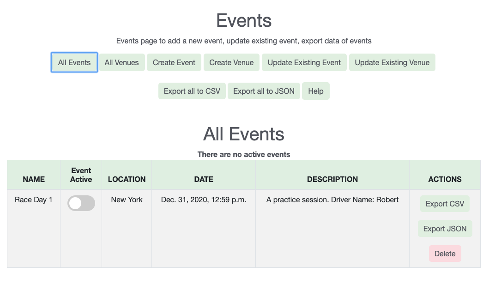
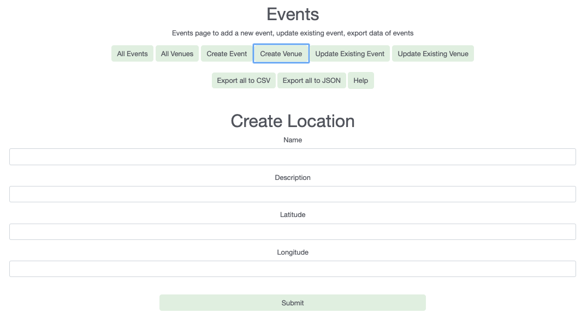
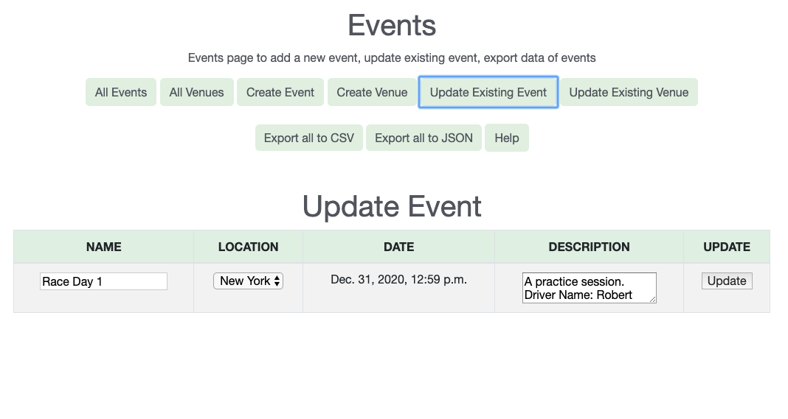

1. All Events
- Events can be considered as the identifier for the incoming data to the application
 from the vehicle. You can view the existing events by clicking on All Events
 
 You should see a table like below:
 
- The different columns of this table are as follows:
    - Name: Name of the Event.
    - Active Event: A switch to make the event active. A single event should be
     active to store the incoming data. All the incoming data to the application is
      mapped to the active event.
    - Venue: The venue of the event. 
    - Description: The description related to the event.
    - Actions: This column lists the different actions available for each event.
        - Export CSV: User can export the data for the event in a csv format by
         clicking on this button.
        - Export JSON: User can export the data for the event in a json format by
         clicking on this button.
         - Delete: User can delete the event by clicking on this button. All
          the event data will be lost if user deletes that event.

2. All Venues
- Venues are coupled with an Event, in order to map the event to a location. You can
 view the existing events by clicking on All Events  <b>You should see a table
  like below:

- The different columns of this table are as follows:</b>
    - Name: Name of the Venue.
    - Description: The description related to the Venue.
    - Latitude: The Latitude for this Venue.
    - Longitude: The Longitude for this Venue.

3. Creating an Event
- Events can be considered as the identifier for the incoming data to the application
 from the vehicle. You can create a new event by navigating to Events tab on sidebar
  and then selecting Create Event.   <b>You should see a form like below:
  
- The different attributes of this form are as follow:</b>
    - Name: Any name of your choice to the event. example: Race 1, Race New York, etc.
    - Date: Select the date of this event in the format `<b>dd/mm/yyyy, hrs:min:AM/PM
    `. All the inputs are mandatory.
    - Description: A small description related to the event. example: Practice for
     Race 1, Testing the newly integrated sensors, etc.
    - Venue uuid: The venue of the event. This is a dropdown selection where we
     can see the list of available venues. If you don't see any venues
     in this list. Make sure you have created a venue. <b>At least one venue is required to create the event.</b></li>
    - Submit: Once you have filled all the values, you can submit and the event
     should be created. To view the event, go to the `All Events` view.

4. Creating a Venue
- Venues are coupled with an Event, in order to map the event to a location. You can
 create a new venue by navigating to Manage Events tab on sidebar and then selecting
  Create Venue.   <b>You should see a form like below:

- The different attributes of this form are as follow:
    - Name: Any name of your choice to the venue. example: New York, California etc.
    - Description: A small description related to the venue. example: Race Track 1
    , Race Track 2 etc.
    - Latitude: Enter the Latitude for this location.
    - Longitude: Enter the Longitude for this location.
    - Submit: Once you have filled all the values, you can submit and the venue
     should be created. To view the venue click on All Venues.

5. Updating an Event
- Once you have created an Event, and wish to update some attributes for the same
 event. You can do it by navigating to Manage Events tab on sidebar and then click on
  Update Event. 
  
  You should see a table like below:
  
- The different attributes you can update are as follows:
    - Name: Updated name of your choice to the Event. example: Race 1, Race 2 etc.
    - Venue:Select the updated venue from the dropdown.
    - Description: An updated description related to the Event. example: Race on
     Track 1 under Driver Robert, Race Track 2 etc.
    - Update: Once you have updated the values, you can click on update and the
     Event details should have been updated.
6. Updating a Venue
- Once you have created a Venue, and wish to update some attributes for the same venue. 
You can do it by navigating to Manage Events tab on sidebar and then click on Update
 Venue. 
 
 You should see a table like below:
 
- The different attributes you can update are as follows:
    - Name: Updated name of your choice to the venue. example: New York, California
 etc.
    - Description: An updated description related to the venue. example: Race
     Track 1, Race Track 2 etc.
    - Latitude: Enter the updated Latitude for this location.
    - Longitude: Enter the updated Longitude for this location.
    - Update:</b> Once you have updated the values, you can click on update and the
     Venue details should have been updated.

7. Export all to CSV
- User can click on this button to download a csv file, which will
 contain the data for all the events.
- The csv file will be having the following columns as shown in the below image:

The different columns are:
- S.No: A serial number assigned to each row of the file. (starting from 1)
- Event Name: Name of the event, specific to the particular row.
- Event Date: Date of the event, specific to the particular row.
- Event Description: Description of the event, specific to the particular row.
- Venue Name: Name of the venue where the event was hosted, specific to the particular row.
- Sensor Name: Name of the Sensor, specific to the particular row.
- Sensor Data TimeStamp: Timestamp of the Sensor while collecting the data, specific to the particular row.
- Sensor Value: Measurement collected for the sensor, specific to the particular row.

8. Export all to JSON
- User can click on this button to download a zip file containing different JSON files
 for each event.
- The JSON file will be having the following structure as shown in below screenshot:
