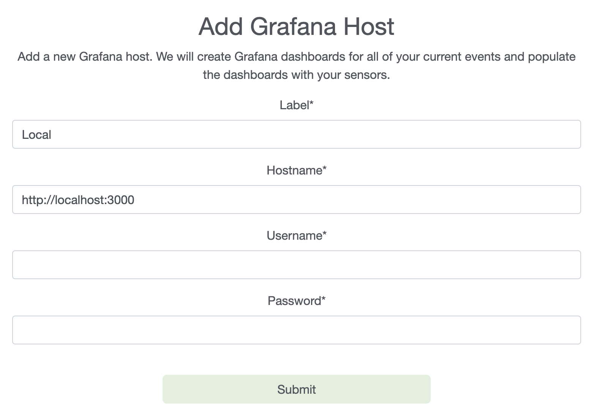
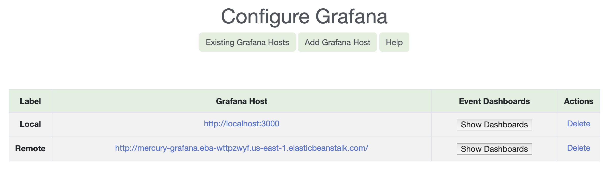
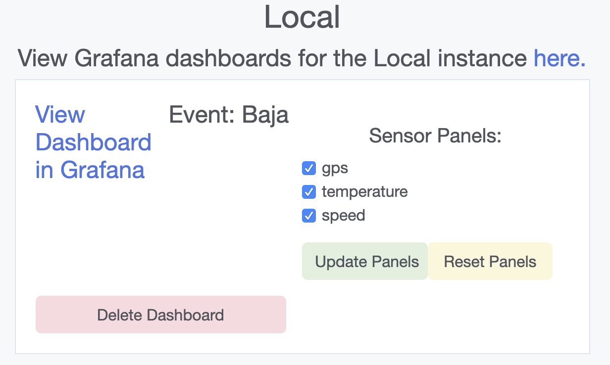
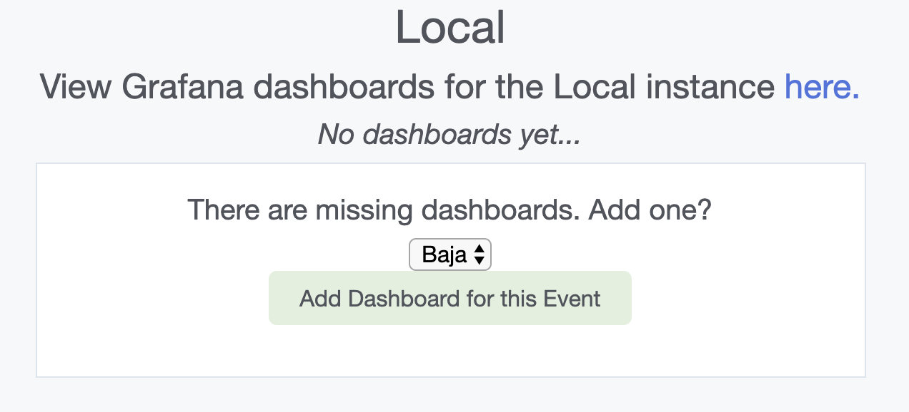
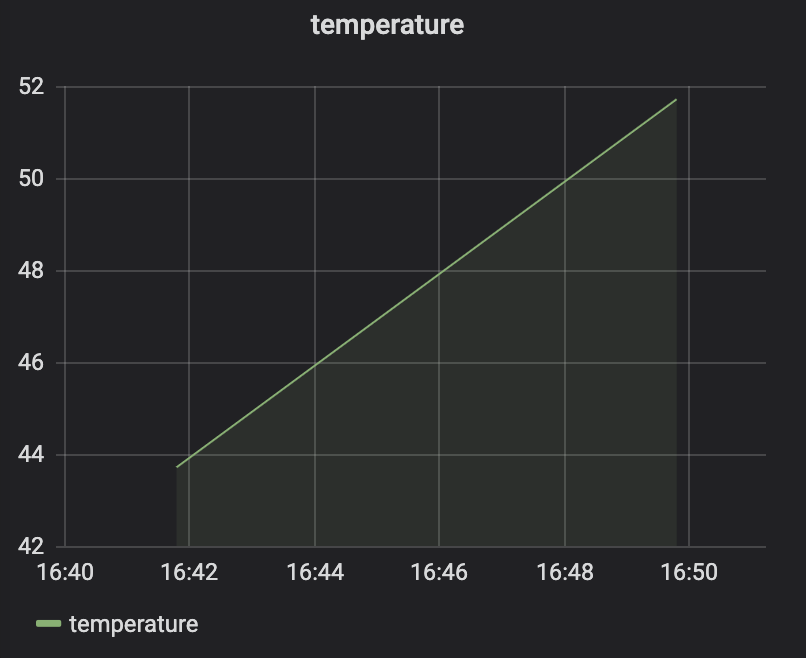
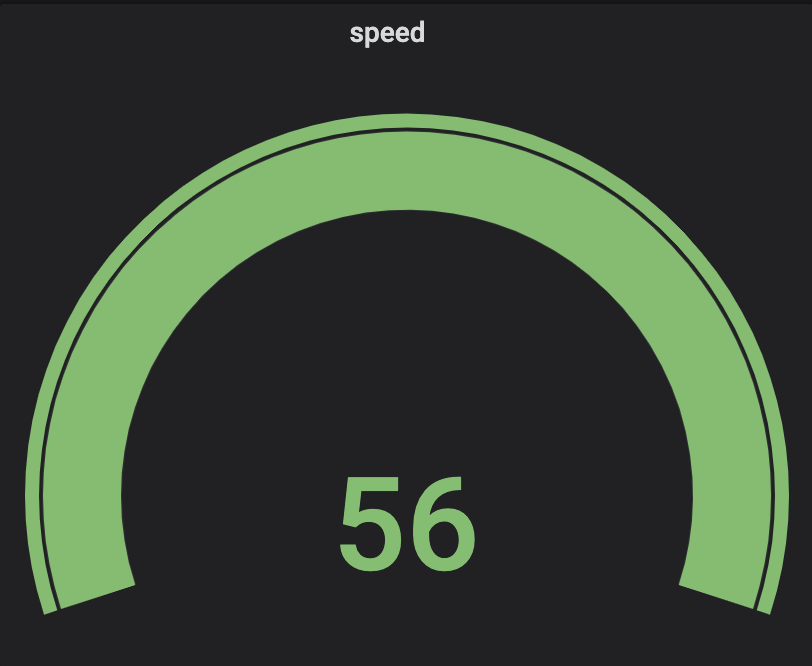

# Configure Grafana
Access and manage your Grafana dashboards directly from the Configure Grafana view.

Mercury is integrated directly with the Grafana time-series visualization tool, so:
- Each time you create an event in Mercury, a dashboard will be created in Grafana
 with sensor panels for all of your sensors at that time.
 
### Contents</h3>

1. Install Grafana
2. Add a Grafana Host to Mercury</a></li>
3. Manage Grafana Hosts
4. Manage Event Dashboards
5. Manage Sensor Panels
- Graph types

### Install Grafana
- You can install Grafana on your local machine or host Grafana.
- Options for hosting include:
    - GrafanaCloud Hosted Grafana: Hosting is done directly by Grafana. (Note: For
     free accounts, there is a limit of 5 dashboards.)
    - Deploy Grafana in a docker container using a hosting service like AWS Elastic
     Beanstalk or Heroku.

### Add a Grafana Host
1. Go to the Add Grafana Host tab.
2. Fill out the Add Grafana Host form (Fig 1):
3. Hit Submit.
4. Once we validate your Grafana details, we will:
    - Create an Event Dashboard for each of your events.
    - Fill each dashboard with Sensor Panels.

> Fig 1. Add Grafana Host form
- **Label:** A name for this grafana host (e.g. Local,
Remote).
- **Hostname:** The Grafana hostname for this host (e.g.
http://localhost:3000, http://abc123.grafana.net).
- **Username:** Your Grafana username. (Grafana's default 
username is admin.
- **Password:** Your Grafana password. (Grafana's default 
password is admin.)

### Manage Grafana Hosts
Use the Existing Grafana Hosts view to manage all of your configured Grafana
 instances (Fig 2a)
1. Go to the Configure Grafana --> Existing Grafana Hosts
2. Choose Show Dashboards to view and manage the dashboards and panels for a host
 (Fig 2b)
 
 
 > Fig 2a.Grafana host table - displays all of the active grafana instances. Hit
> `Show
> dashboards` to see a Grafana host's dashboards.
 - Delete: Deletes the GFConfig. Wipes the Grafana instance of all dashboards and datasources. 

### Manage Event Dashboards 

- (Fig 2b):
- Delete Dashboard: Deletes the entire dashboard from Grafana.
(Once you delete a dashboard, you can create it again, but 
any of your previous setting changes will be lost.)
- Update Panels: For choosing which sensor panels to display 
in the dashboard. Choose from the Sensor Panels list. All of
the panels will be restored to their default settings.
- Reset Panels: Reset the dashboard to include all of the 
currently available sensors. All of the panels will be 
restored to their default settings. 
- View Dashboard in Grafana: View and edit the dashboard 
in your Grafana instance.
 
 > Fig 2b. The Local Grafana instance has one event, Baja.
 The Baja dashboard has 3 sensor panels: GPS, temperature, and speed.

#### Add an Event Dashboard (Fig 3)
1. Create an Event (if you haven't already).
2. Go to `Existing Grafana Hosts`--> `Show Dashboards` for the 
Grafana host you are trying to add the dashboard to.
3. If the event dashboard doesn't already exist in Grafana, 
you will see an option to add a dashboard (Fig 3). 
4. Select an event from the dropdown and `Add Dashboard for this Event`

> Fig 3. Create Dashboard form for the Baja event.

### Manage Sensor Panels

#### Graph Types
Sensor panels may be displayed as:
- Time-series: 

    - This is the default graph type for sensor panels. 
    - This graph type is appropriate sensor types with any number of fields (1
    +). Each field will be graphed as a separate line with a different color.

- Gauge:

    - Used to display the **current** value of a sensor. 
    - Note: This gauge will display the
     most recent value in the current time range you are viewing in the Grafana UI
     . Make sure your time range is set for `<some time>-now`, so that you are
      getting the most recent value (we set the dashboard to this level of zoom for
       you by default, but users who need to change the zoom will need to be
        aware of this) **You can always use the `Reset Dashboard` option to refresh
         your dashboard to its default settings.
    
    - This graph type can only be used for sensor types with a **single
    value**.
- Map:

> TrackMap panel for displaying GPS (latitude/longitude)
data. 

As you add, remove, and update your sensors and events in
 Mercury, you will see the changes in Grafana.
