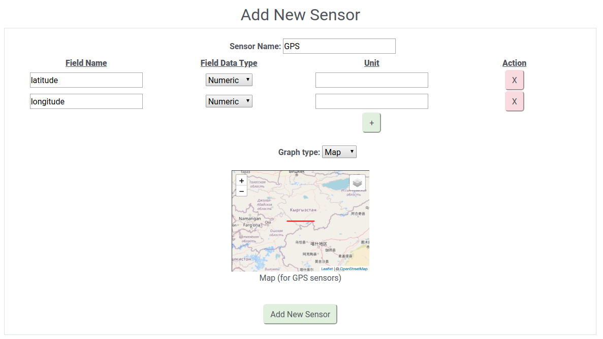
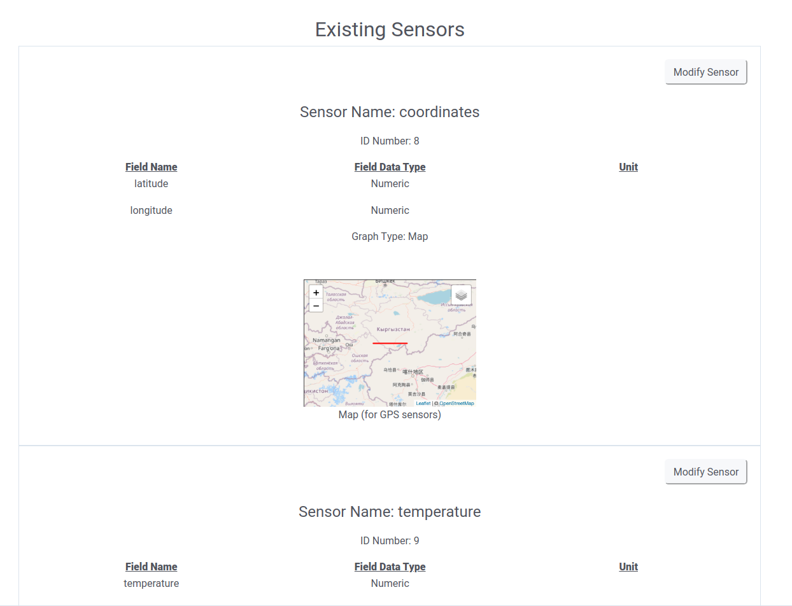
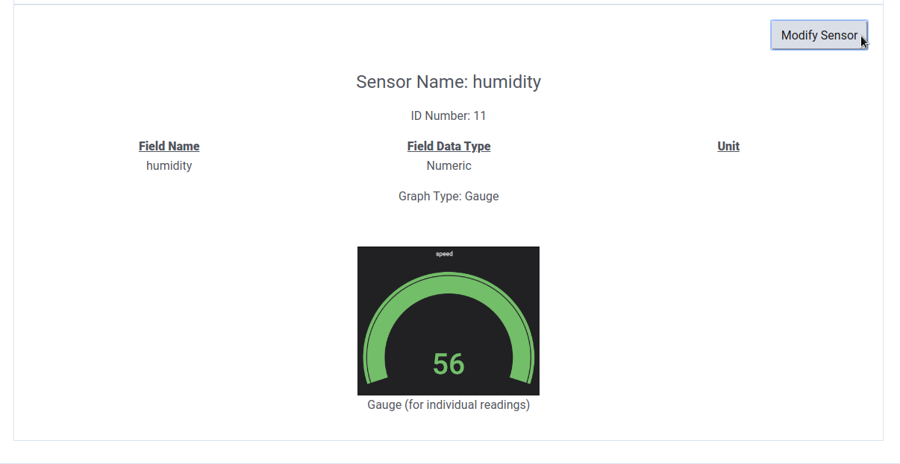
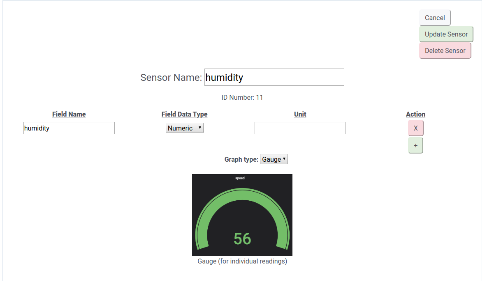

# Configure Sensors
To navigate to the configure sensors page, click on the "Configure Sensors" icon on the left side of the webpage. The configure sensors page is broken into two components: adding new sensors and managing existing sensors. 

## Adding New Sensors
In order to add a sensor to your Mercury instance, you must use the following Add Sensor Form, which can be found at the top of the configure sensors page.

- Sensor Name
  - To add a new sensor, first type a name into the sensor name box. 
  - Restrictions:
    - All sensors must have non-empty names.
    - You cannot have two sensors with the same name in the database. Note that all sensor names are stored in lowercase in the database, so this restriction is NOT case sensitive.
- Fields
  - Once you decided on the sensor name, it's time to give your sensor some fields. For some sensors, such as a temperature sensor, one field is enough. In this case, it is perfectly acceptable to name your field the same as your sensor name.
  - For other sensors, such as a triple-axis accelerometer, multiple fields are required. In this case, you can click the green "+" button at the bottom of the Action column to add a new field. 
  - Notice that each field row also has an "X" in its Action column; if you accidentally inserted too many fields, you can always delete any of the fields with this "X" button. 
    - However, there always must be at least one field per sensor. This is enforced by our UI, so don't worry about deleting too many fields; the app won't let you.
  - For each field, there are three potential data types: numeric (float), character (string), and boolean. Choose whatever data type is appropriate for each individual field.
  - Each field has a "Unit" option for user convenience. Units are not mandated.
  - Restrictions
    - A sensor cannot have two fields with the same name.
    - All fields must have non-empty names.
- Graph Type
  - On the bottom of the add sensor form you will see a dropdown labeled Graph Type. Here you can choose the default way that data from the sensor will be viewed on Grafana. 
  - Further graph customization options (bar graphs, absolute values, etc) are available within your Grafana instance.
- Once you've added all of your sensor fields and chosen the default graph type for Grafana, hit the "Add New Sensor" button at the bottom of the form. The sensor will then be saved in the database and a panel with the graph type you chose will be created automatically in Grafana.

### Adding GPS Sensor
The GPS sensor receives special treatment in Mercury. In order to add a GPS Sensor, you must give exactly two fields with the names "latitude" and "longitude". You also must choose "Map" as your graph type. The sensor name can be whatever you wish, so long as it complies with the restrictions listed above. An example of a properly formatted GPS sensor can be seen below:

## Viewing Existing Sensors
In order to view your existing sensors, navigate to the configure sensors page and scroll beneath the add sensor form. If you have any existing sensors, they will appear here, as seen below.

Notice that each sensors has a unique, auto-generated ID number. This ID number is critical as it allows you to link the sensor you create through the UI with the actual physical sensor hardware. Sensor ID is not editable.

### Updating/Deleting Existing Sensors
With Mercury, the sensors you make are entirely customizable after creation. In order to modify an existing sensor, scroll down on the webpage until you find the sensor you want to edit. Once there, hit the "Modify Sensor" button toward the top-right of the sensor's panel, as pictured below.

Once you hit the button, all of the sensors fields will become customizable, including the sensor name itself, as pictured below.

Potential updates to sensors include:
- changing sensor name.
- changing field names.
- changing field types.
- changing field units.
- adding fields.
- deleting fields.

In order to confirm your changes, hit the green "Update Sensor" button in the top right. If you do not want to save your changes, you can hit the gray "Cancel" button in the top right.

If you want to delete the sensor, hit the red "Delete Sensor" button in the top right. A warning message will pop up letting you know that deleting a sensor will cause all of the data gathered by the sensor to be deleted, so you may want to export your data before deleting a sensor.

Note that all restrictions that applied to adding new sensors apply to editing existing sensors as well. See above section on adding new sensors for details.